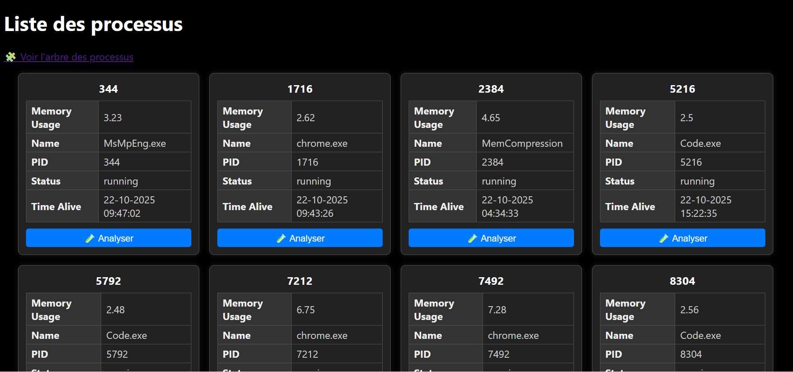

# Process Viz (current project)


Process Viz is a fast and asynchronous web application designed to capture and visualize process snapshots on a server. Built initially with Flask and evolving towards Quart with asyncio, it allows users to browse and analyze system processes in real-time through a clean web interface.

### Table of contents

- [Expectations](#expectations-at-051025)
- [DevLog](#where-i-am-at-141025)
- [Improvements](#possible-improvements)
- [Learning Objectives](#what-i-want-to-learn)
- [What I learned](#what-i-learnedrelearned)

## How to launch things
- ```git clone http://www.github.com/Khabibulix/Mono-Python```
- ```cd Mono-Python\2025\ProcessViz```
- ```python app app.py``` for main web-app
- ```pytest``` to launch tests


## Expectations at 05/10/25

- Script that generate processes snapshots to stock on a server
- Fast and asynchronous
- FastAPI stack with SQLAlchemy and TDD method
- Feature to navigate in processes, a bit like a C&C

## Expectations at 08/10/25

- Process viewer in a basic web page
- Consulting a process via its PID
- View metrics for memory, CPU usage... etc

###  📅 14/10/25

Web app is styled with CSS, vanilla CSS and I'm using JS to grab a click event on a process and display it in a new Flask route. The web-app looks slow to load but is working as intended.
Next step is to analyze the process to display a _score of trust_, it will be the beginning of data visualisation.

###  📅  16/10/25

Full glow-up on all the web-app. Switching to Quart + asyncio speeds up the loading. However, i got a Lighthouse score of 55 in performances, which is pretty bad. The content is available after 21,4s and its size is 176KiB. After caching and Quart migration, content is available after 1,7s, and performance score is at 97.

###  📅  18/10/25

Working on DLL and opened files. It is now possible to check certain metrics about a process via its PID, if a file is signed, if the path is a standard one. All of that displays a _risk level_


###  📅  19/10/25

Adding loggings features and removing _asyncio_ noise, quick debug on process main page click events.
Optimizing _psutil_ with ```attrs[]```, calls are less frequent, then faster. Beginning of TDD for all processes classes.

### 📅 20/10/25
Resolved recurring issues with Async/Await, nasty bugs these ones! 🤯 Developed unit tests for the `ProcessAnalyzer` class using `unittest.mock` to simulate `psutil` behaviors and utility functions (`is_signed`, `is_invocating_scripts`, etc.). Adjusting mocks to precisely reflect real execution conditions, including normalization of suspicious executable paths with `.lower()`.

### 📅 21/10/25
Set up asynchronous testing environment with `pytest-asyncio`. Fixed errors related to unawaited coroutine objects by properly awaiting async fixtures.
Mocked various dependencies (`psutil`, `is_signed`, etc.) in tests to isolate the `ProcessAnalyzer` behavior.Achieved all tests passing successfully, writing tests for ProcessAnalyzer. ```Pytest-cov``` score is at 60% for ```process_manager.py```
_Auto Fetch()_, page reloads automatically without user intervention. Using full ```JS/AJAX```, not needing more. 
Broke LightHouse Score, currently at 40.

### 📅 22/10/25
Full glow-up for speed, removing some infos on the first page the user sees, adding a button to analyse and display more. 

Front-end is quicker still with full AJAX. 

Reaching 91% of test coverage for ```process_manager.py```

Fighting with CSS, currently the layout is like this:



### 📅 23/10/25

_Plan for the day_: Transition from _polling AJAX_ to _WebSocket_ for ```/``` route to have a "live" view of the processes.
Organizing project with ```/app``` and others mains refactorisations

### 📅 24/10/25

Cleaning ```app.py``` for better structure.

### 📅 05/11/25

Implementation of WebSocket, linting/testing all project before each commit with ```black/pytest``` More styling for index page.

### Strange behaviour to fix

- ✅    Unclickable buttons (<button> element was not correctyl placed)
- ✅    Broken route for /process/<pid> (Blueprint for DLL link was not correctly called in template)
- CSS not linked correctly for /process/<pid> route


## Possible improvements that i will make

- ✅    Make it quicker
- ✅    Add a real logging file for easier debug
- ✅    Styling of _waiting web-page_
- ✅    Process Tree
- ✅    DLL & files opened
- ✅    Opening and inspecting DLL files on click
- ✅    Profile code
- ✅    Optimize _psutil_ with attrs
- ✅    Read files async style with _aiofiles_
- ✅    Pytest rapport to check tests coverage
- ✅    Auto fetch() without reloading page for standard access in /
- ✅    Lazy loading, load only x's first processes
- ✅    Full test coverage for classes
- ✅    WebSocket implementation

- More DLL infos with pefile
- Geolocation of opened connections
- DB conn (Tortoise!!)
- Optimize fetching of services with _WMI Watcher_ or _psutil_

## Possible improvements that i will **NOT** make

- Plugin System and _REPL_ for modifying system while running
- _Hierplane_ for displaying tree
- Workers _Dask_
- Hashing files in _WebAssembly_ in _Rust-WASM_
- Visual profiling of application's speed
- Dynamic dashboard Event-Driven with Asyncio.Queue


## What i want to learn

- Basic API design
- Processes under the hood

## What i learned/relearned:

- Jinja templates, playing with Win32 APIs
- Review for dictionary/JSON
- Services
- Hashlib, Radon, Signtool, Psutil
- Quart, Context processor
- Async/Await for Files(```aiofiles```) or Requests(```asyncio```)
- Py-Spy, Mocking with _unittest.mock_